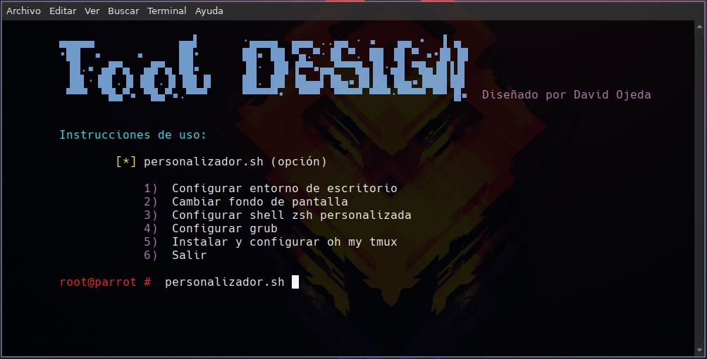

# Personalizador linux

Este script te permite mejorar el entorno de trabajo de tu sistema operativo Linux.
Mejora el diseño y te permite trabajar con mayor fluidez. 
Este script fue testado en Parrot Security y Kali linux.
Este entorno de escritorio es el que uso en el dia dia.

## Comenzando 🚀

Descargue y ejecute el sript en bash con el siguiente comando:
```
bash personalizador.sh
```
<p align="left">

</p>


### Opciones ⚙️
**1)** Esta opción te pregunta por el usuario en el que quieres instalar bspwm, sxhkd, compton y todas las utilidades necesarias para el correcto funcionamiento del script, tras esto, configurara automaticamente los archivos, las fuentes...
Finalmente, te pedirá si quieres reiniciar el equipo

**2)** Anteriormente se habra instalado feh, una utilidad con la que se podra cambiar el fondo de pantalla en bspwm, esta opción solo te pedira el usuario en el que cambiar la imagen, y la ruta de la imagen que deseas establecer como fondo de escritorio
(Para aplicar cambios basta con cerrar sesion o pulsar las teclas [WINDOWS + ALT + r] )

**3)** Esta opción configurará una shell zsh en el usuario que elijas, configura plugins, como el sudo, el autosugestion y el autocomplete. Mejora la estetica de comandos como, help, cat, ls...

**4)** Mejora la personalización del grub con el tema TELA		#No funciona en kali linux

**5)** Instala y configura oh my tmux

**6)** Sale del script, si no pones una de las anteriores opciones, también sale


## Instrucciones 📖

**WINDOWS + ENTER:** Abrir una terminal

**WINDOWS + s:** Pasar la terminal a modo pequeño y movible

**WINDOWS + f:** Volver al modo grande y no movible

**WINDOWS + w:** Cerrar la terminal

**WINDOWS + t:** Posiciona la terminal el la pantalla, sirve para ir moviéndose entre terminales

**WINDOWS + m:** Posiciona la terminal pantalla grande pero sin tapar la polivar, tambian la minimizas a como estaba antes

**WINDOWS + d:** Abre el buscador de programas

**WINDOWS + CTRL + flechitas:** Mueve la terminal

**ALT + CTRL + flechitas:** Juegas con el tamaño de la terminal, caja…

**WINDOWS + CTRL + ALT + Flechitas:** Seleccionas el lugar donde lanzar el terminal, con **WINDOWS+CTRL** y un numero entre el **1 - 9** seleccionas el tamaño del terminal y para quitar la preeseleccion es con **WINDOWS+CTRL+ Espacio**

**WINDOWS + ALT + r:** Para reiniciar el servicio y que se guarden los cambios

**WINDOWS + ALT + q:** Para cerrar sesión 


## Autor ✒️
* **David Ojeda Guijarro**

* Inspirado en [**s4vitar**](https://www.youtube.com/watch?v=MF4qRSedmEs)


#### Construido en bash 🛠️
